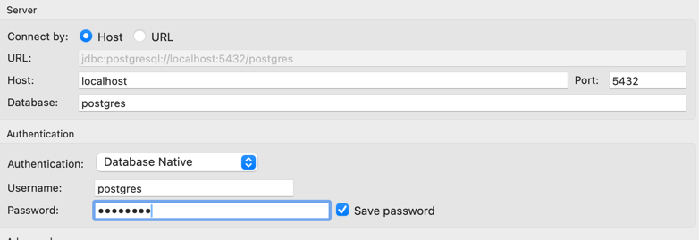

# Metycle Analyst Challenge

Please find the description of the task in the PDF file that comes along with the challenge. In case you have not
received it please reach out. The README files contains some technical details that may help you with the challenge.

## Spinning up a database

In case you need a starting point to spin up your own database locally, here are instructions to spin up a docker image
with a postgres database locally and connecting to it. You are free to use any other suitable way. Alternatives to a
postgres database are, for example, [duckdb](https://duckdb.org/) or [sqlite](https://sqlite.org/).

### Use Docker to run a local postgres database and connect to it

You can spin up a postgres database on your local machine with Docker and import the data from the csv files:

* Install docker: https://docs.docker.com/get-docker/
* Run `docker run --name postgres_db -e POSTGRES_PASSWORD=postgres -p 5432:5432 -d postgres:latest`
* You can now connect to your postgres database via localhost on port 5432
* You can use a free database client like [DBeaver](https://dbeaver.io/download/) or [pgAdmin](https://www.pgadmin.org/download/)
to connect to the database running on your docker container with user and password being "postgres". See the screenshot
below

### Importing the data
In case you are not sure how to get the data into the database, here are some tips:

In your database client, you can open a sql console and run the code in [ddl.sql](sql/ddl.sql) to create the tables and 
use the interface to import the csv files into the tables. You can also directly import the csv files, but ensure that
the created tables are of data type `varchar`/`text` for string and `numeric` for numerical data. Some database clients 
will create limited data types like `varchar(256)`
